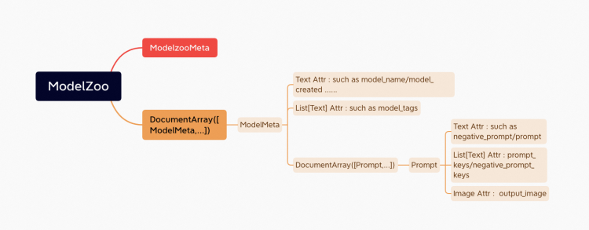
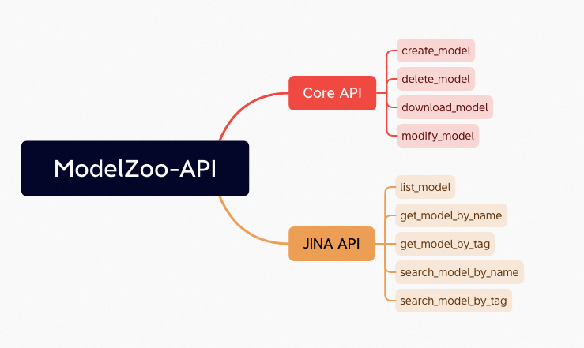
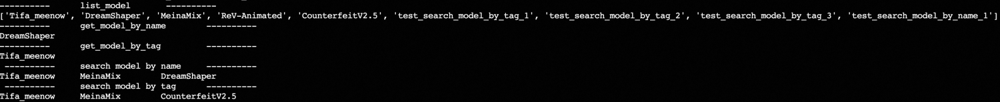
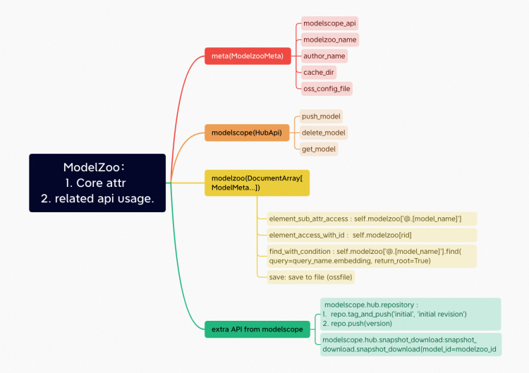

## ModelZoo

A modelzoo lib based on
- Python >= 3.7
- ModelScope   : [github](https://github.com/modelscope/modelscope)
- PAI-DocArray : [gitlab](https://code.alibaba-inc.com/zhoulou.wzh/pai-docarray), [whl](http://pai-vision-exp.oss-cn-zhangjiakou.aliyuncs.com/wzh-zhoulou/metric_learning/230303/docarray-0.17.1-py3-none-any.whl)

- Design Document : [Lark](https://yuque.antfin.com/pai-innovative-algo/dvoo0c/lrk6zl04v2epq3ng?singleDoc# 《ModelZoo-设计》)
- API    Document : [Lark](https://aliyuque.antfin.com/pai-innovative-algo/dvoo0c/lfyu85t4hahp4z3s?singleDoc# 《ModelZoo-API》)

## ModelZoo API
- ModelZoo 对象包含的数据结构的简介, 包含一个ModelScope API 对象和一个用于存储ModelMeta的DocumentArray对象<br>


- API <br>


### CORE-API
| 接口名称 | 简短说明 | 使用方式 |
| --- | --- | --- |
| __init__ | 初始化函数 | model_zoo = ModelZoo(modelscope_api) |
| save | 保存本地模型仓库 | model_zoo.save() |
| download_model | 下载指定模型 | model_zoo.download_model(model_name, output_dir=None) -> None |
| create_model | 创建一个新的模型 | model_zoo.create_model(model_dir, model_name=None, model_description='', model_tags=[]) -> Document |
| delete_model | 删除指定名称的模型 | model_zoo.delete_model(model_name) -> str |
| modify_model | 修改指定名称的模型 | model_zoo.modify_model(model_dir, model_name, version=None, description=None) -> str |
#### DEMO
```python
modelscope_api = "xxxx"  # modelscope sdk
model_dir = "xxxx"  # your own model directory
model_zoo = ModelZoo(modelscope_api)
model_zoo.create_model(model_dir)
model_zoo.modify_model(model_dir, "update_model_name")
model_zoo.delete_model("update_model_name")
model_zoo.download_model("modelscope_exist_model")
model_zoo.save()
```
1. 创建了一个 `ModelZoo` 对象，以连接到指定的 ModelScope API
2. 调用 `create_model` 方法创建一个新的模型并添加到模型仓库中（远程与本地）
3. 使用 `modify_model` 方法更改刚刚创建的模型的名称为`update_model_name`
4. 使用`delete_model`方法删除名称为`update_model_name`的模型
5. 使用`download_model`方法从远程模型仓库下载名为`modelscope_exist_model`的模型并保存到本地
6. 最后，使用`save`方法将本地模型仓库保存到磁盘上


### JINA-API
| 接口名称              | 简短说明                             | 使用方式                                                         |
|---------------------|--------------------------------------|------------------------------------------------------------------|
| list_model          | 列出所有的模型名称                   | model_zoo.list_model()                                           |
| get_model_by_name   | 根据名称获取模型信息                 | model_zoo.get_model_by_name(name: str, **kwargs) -> Optional[文档] |
| get_model_by_tag    | 根据标签获取模型信息                 | model_zoo.get_model_by_tag(tag: str, **kwargs) -> Optional[List[文档]] |
| search_model_by_name| 根据名称搜索模型                     | model_zoo.search_model_by_name(name: str, **kwargs) -> Optional[List[文档]] |
| search_model_by_tag | 根据标签搜索模型                     | model_zoo.search_model_by_tag(tag: str, **kwargs) -> Optional[List[文档]] |
| __call__            | 返回 modelzoo 的内容，即模型信息的 DocumentArray 对象 | model_zoo()                                                     |
#### About Levenshtein
The Levenshtein library in Python provides functions for calculating the Levenshtein distance between two strings, which is also named editing distance. The library includes two main functions: levenshtein() and ratio(), which can be used for various applications like spell checking and fuzzy string matching.

`levenshtein(s1, s2)`: This function takes two strings `s1` and `s2` as input and returns the Levenshtein distance between them.

`ratio(s1, s2)`: This function takes two strings `s1` and `s2` as input and returns a similarity ratio between 0 and 1, where 0 means the strings are completely different and 1 means they are identical. The similarity ratio is computed as `1 - (levenshtein(s1, s2) / max(len(s1), len(s2)))`.

#### DEMO
```python
# list_model
result = mz.list_model()
print("-" * 10, "\tlist_model\t", "-" * 10)
print(result)

# get_model_by_name
model_name = "DreamShaper"
model_by_name = mz.get_model_by_name(model_name)
print("-" * 10, "\tget_model_by_name\t", "-" * 10)
print(model_by_name.model_name.text)

# get_model_by_tag
model_tag = "Tifa"
model_by_tag = mz.get_model_by_tag(model_tag)
print("-" * 10, "\tget_model_by_tag\t", "-" * 10,)
for model in model_by_tag:
    print(model.model_name.text, end="\t")

# search_model_by_name
part_model_name = "meenow"
searched_model = mz.search_model_by_name(part_model_name)
print("\n", "-" * 10, "\tsearch model by name\t", "-" * 10)
for model in searched_model:
    print(model.model_name.text, end="\t")

# search_model_by_tag
part_model_tag = "Final"
searched_model = mz.search_model_by_tag(part_model_tag)
print("\n", "-" * 10, "\tsearch model by tag\t", "-" * 10)
for model in searched_model:
    print(model.model_name.text, end="\t")
print()
```
#### JINA API Result


## RelateAPI
所有涉及到到ModelScope 和 DocArray的API，我们用下图去汇总一下<br>


